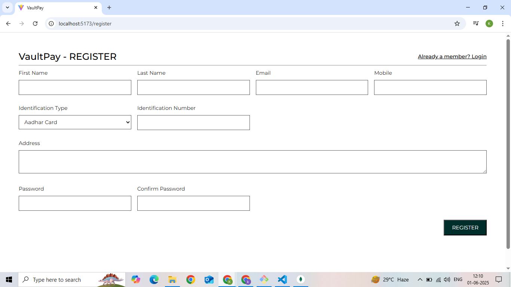
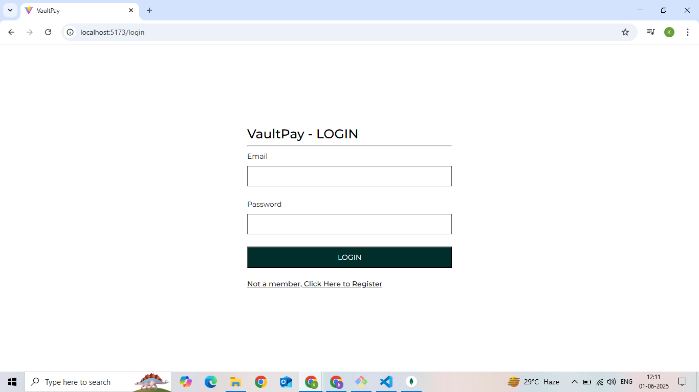
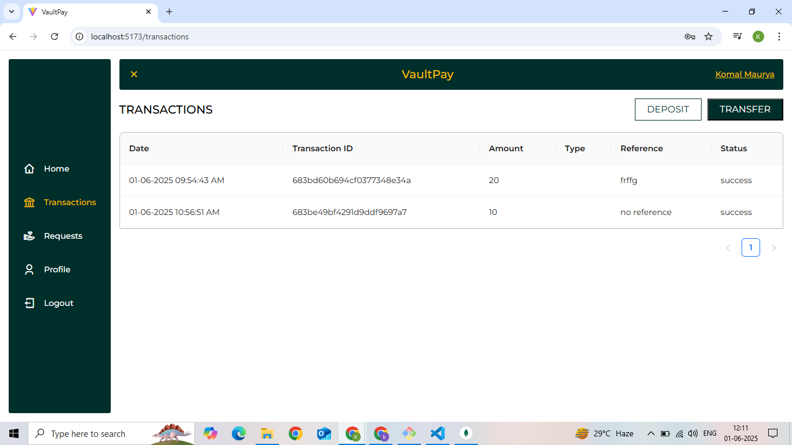

# VaultPay 💸

**VaultPay** is a secure, full-featured digital wallet system built using the **MERN stack** (MongoDB, Express.js, React.js, and Node.js).

---

## 🔐 Features

### ✅ Core Features
- **User Registration & Login**
  - Secure authentication with JWT
  - Password hashing with bcrypt

- **Wallet Dashboard**
  - Check available balance
  - View recent transactions
  - Real-time feedback on transfers

- **Fund Transfers**
  - Transfer money using recipient account number
  - Live **Account Verification** before transfer
  - Description and amount validation

- **Transaction History**
  - Filtered view of sent and received payments
  - Timestamps and descriptions included

### 🚀 Bonus Features
- **Admin Dashboard**
  - View and manage all users
  - Monitor transactions system-wide
  - Block/suspend suspicious accounts (planned)

- **Basic Fraud Detection**
  - Prevent rapid repeated transactions
  - Flag abnormal behavior (demo logic)

- **Loader & Feedback**
  - Smooth user feedback with Ant Design Modals
  - Custom success and error toasts

---

## 🛠️ Tech Stack

| Tech        | Description                    |
|-------------|--------------------------------|
| **MongoDB** | NoSQL database for user and transaction data |
| **Express** | Backend framework for API routing |
| **React**   | Frontend UI using Ant Design components |
| **Node.js** | Runtime environment for backend server |
| **Redux Toolkit** | State management (loading, auth, etc.) |
| **JWT**     | Secure user authentication |

---

## 📸 Screenshots

> 📍 
> 📍 
> 📍 

---

## 🚀 Getting Started (Local Setup)

```bash
# Clone the repo
git clone https://github.com/KomalMaurya/VaultPay.git
cd VaultPay

# Install frontend dependencies
cd client
npm install
npm start

# Open new terminal for backend
cd ../server
npm install
npm run server
